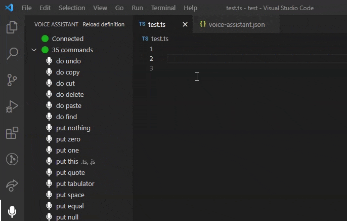

# Voice Assistant for VSCode

  

The voice assistant for Visual Studio Code. This extension allows you to put code snippets into the code by voice. Also, you can execute any Visual Studio command by voice. The extension works with any language, because the file with voice commands is placed in the project folder (voice-assistant.json). So, you can prepare own voice commands for each project.

🔥 Features:

* multiple windows support,
* diffrent voice commands for each project,
* easy voice commands reloading,
* it works with every language (TypeScript, JavaScript, HTML, CSS, PHP, C#...),
* VSCode command executing.

## 🚀 How to Start?

1. **Install this extension** from the marketplace.
2. **Install a server**. The server is necessary, because it does all speech recognition job. Currently we support only Windows.  
   💾 [Download server for Windows](https://github.com/b4rtaz/voice-assistant-net-server/releases/download/v0.1.0/VoiceAssistant.Server.0.1.0.zip) (it requires [.NET5](https://dotnet.microsoft.com/download/dotnet/5.0))
3. **Add `voice-assistant.json` file** to root directory of your project and click "Reload definition". You may use [this example file](media/voice-assistant.json) or click "Add example voice-assistant.json" button.
4. You can start speaking. 🎤

## 💡 License

This project is released under the MIT license.
